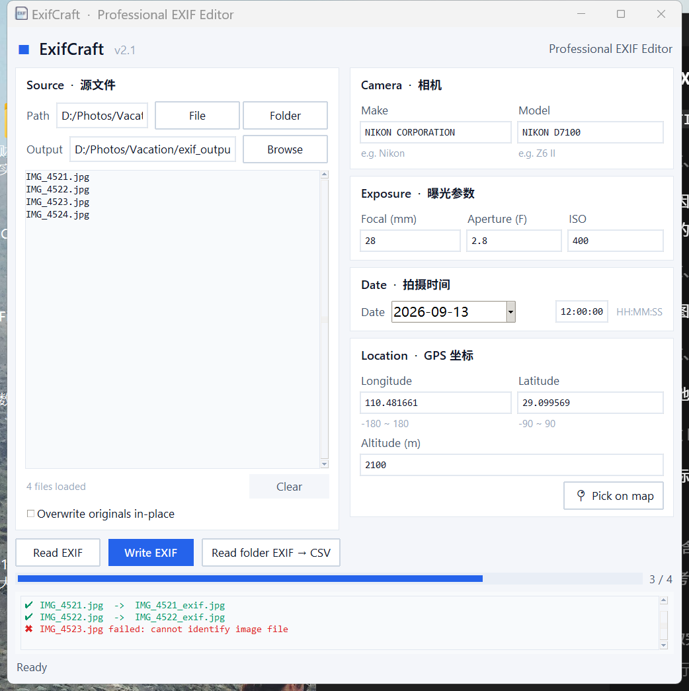

# ExifCraft

**Professional EXIF Editor** — 一个干净、现代的图片元数据（EXIF）读写工具。

ExifCraft 是一个纯 Python 桌面应用，基于 Tkinter 构建，无需浏览器、无需安装大型框架。它可以批量读取和写入图片的 EXIF 元数据，包括 GPS 坐标、相机信息、曝光参数和拍摄时间，并可将整个文件夹的 EXIF 信息导出为 CSV。



## ✨ 功能特性

- **EXIF 写入** — 将 GPS 坐标（经度 / 纬度 / 海拔）、相机制造商与型号、焦距、光圈、ISO、拍摄时间写入 JPEG / TIFF / PNG 等格式图片
- **EXIF 读取** — 选中列表中的文件，一键回填所有字段到表单
- **批量处理** — 支持选择单个文件或整个文件夹，后台线程处理，不阻塞界面，带进度条
- **地图选点**（可选）— 集成 `tkintermapview`，点击地图即可拾取 GPS 坐标
- **日期选择器**（可选）— 集成 `tkcalendar`，日历控件选择拍摄日期
- **CSV 导出** — 一键将文件夹内所有图片的 EXIF 摘要导出为 CSV 表格
- **安全写回** — 默认输出 `*_exif` 副本，不修改原图；也可勾选原地覆盖
- **现代 UI** — 浅色卡片式界面，跨平台 ttk 主题，Windows 下自动启用 HiDPI 适配
- **输入校验** — 经纬度范围、数值格式、日期格式等全部前端校验，错误信息清晰

## 🚀 快速开始

### 环境要求

- Python 3.10+

### 安装依赖

```bash
pip install -r requirements.txt
```

> `PyMuPDF` 为可选依赖，仅用于从 `app_icon.svg` 重新生成图标，运行应用不需要它。

### 运行

```bash
python ExifCraft.pyw
```

> `.pyw` 扩展名表示无控制台窗口运行，直接双击即可启动。

## 📖 使用说明

1. 点击 **File** 选择单张图片，或点击 **Folder** 选择整个文件夹（自动扫描其中的图片）
2. 填写右侧表单：
   - **Camera** — 相机制造商（如 Nikon）与型号（如 Z6 II）
   - **Exposure** — 焦距（mm）、光圈（F 值）、ISO
   - **Date** — 拍摄日期与时间（格式 `YYYY:MM:DD HH:MM:SS`）
   - **Location** — 经度（-180 ~ 180）、纬度（-90 ~ 90）、海拔（米）；安装 tkintermapview 后可点击 📍 在地图上选点
3. 点击 **Read EXIF** 可先读取选中文件的现有元数据并回填表单
4. 点击 **Write EXIF** 开始写入：
   - 默认在输出目录生成 `<原文件名>_exif.<扩展名>` 副本（JPEG 以 quality=100 保存）
   - 勾选 *Overwrite originals in-place* 可直接覆盖原图，请谨慎使用
5. 点击 **Read folder EXIF → CSV** 可将当前文件列表中所有图片的 EXIF 信息导出为 CSV

## 📦 打包发布

支持 PyInstaller 打包为独立可执行文件：

```bash
pyinstaller --onefile --windowed --icon ExifCraft.ico ExifCraft.pyw
```

## 🗂 项目结构

```
ExifCraft/
├── ExifCraft.pyw     # 主程序（单文件应用）
├── ExifCraft.ico     # 应用图标（Windows，多分辨率）
├── preview.png       # 界面预览图
├── requirements.txt  # 依赖清单
└── README.md
```

## 📄 许可证

[MIT](LICENSE) © yohoten
